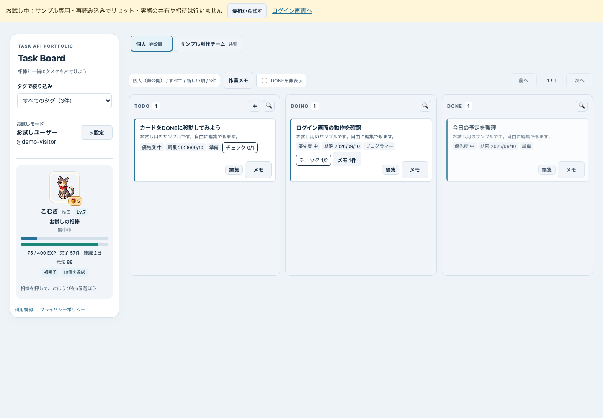

# Task Board

Web版とWindows版を管理するリポジトリです。Web版はASP.NET Coreとブラウザーで動作します。Windows版はC# / WPF / WebView2で既存の画面を表示し、共通のAPIとDBに接続します。Windows版の起動・ビルド方法は [desktop/README.md](desktop/README.md) を参照してください。

## 開発履歴について

開発用GitHubアカウントの移行に伴い、2026年9月10日に、それまでに実装したWeb版を初回コミットとしてこのリポジトリへ取り込みました。移行前の個別のコミット履歴は含まれておらず、このリポジトリの作成日・コミット数は、開発全体の期間・変更回数を表すものではありません。

移行前の改善内容や検証結果は、[操作性の改善記録](docs/WORKFLOW_V24_WORK.md)と[全機能デバッグの記録](docs/FULL_FEATURE_DEBUG_2026-09-09.md)にまとめています。移行後の変更はコミット履歴に記録しており、[Windows版0.1.1の変更・検証記録](docs/WINDOWS_V011_WORK.md)も参照できます。

## Web版とWindows版の開発方針

- `main`：Web版と共通APIの安定版。現在の実装をここに置きます。
- `feature/windows-client`：Windows版を開発するときの作業ブランチ。動作確認後に`main`へ統合します。
- Web画面は`frontend/`、Windowsクライアントは`desktop/`に分けます。認証・タスク・チーム・報酬のAPIとDBは共通です。

WindowsとWebは変更単位のブランチで開発します。Windows版の初版は、接続先設定・同梱デモ・ブラウザー経由のログインに対応しています。ポートフォリオ用の紹介ページ・ブラウザ体験版・Windows版の直接配布は `portfolio/` で管理します。実アカウントを保存する公開APIサーバーと、署名付きインストーラーは未提供です。

個人・小規模チームのタスクを管理し、完了をペットと喜ぶポートフォリオアプリです。
ASP.NET Core / PostgreSQL / HTML・CSS・JavaScriptで実装しています。

GitHub ActionsのCI設定は `.github/workflows/ci.yml` にあります。

[ローカルのアプリ](http://localhost:5097/) · [登録不要デモ](http://localhost:5097/index.html?demo=1)

上記のローカルURLはこのアプリを起動したPCでのみ利用できます。案件先に案内する入口は [ポートフォリオ用の紹介・配布ページ](https://taskboard-js-portfolio.jin-shirai-developer.chatgpt.site/p/90e0188e5bdccda266e5a1fa3562c985/) です。ブラウザ体験版とWindows版のダウンロードに進めます。推測しにくいURLと検索除外で案内範囲を絞っていますが、URLの転送先でもアクセスできます。

体験版はブラウザ内の一時データだけを使い、再読み込みでリセットします。実際の招待・保存・Google認証・Stripe接続は、別途起動した通常版サーバーの機能です。[配布サイトの構成・更新方法](portfolio/README.md) を参照してください。

## 使い方

1. 上部の「＋ タスク追加」で登録。カードの「完了」やステータス選択で状態を変更できます。入力中に閉じる場合は破棄確認が出ます。
2. 上部タブで個人と参加チームを切り替えます。個人タスクは非公開です。同じタブで再読み込みした場合は、直前に選んだワークスペースを開きます。
3. 「検索・絞り込み」で全ステータスのタイトル・説明を検索。「自分の担当」「今日まで」「期限超過」と期限順も利用できます。
4. 「お助け依頼」で全チームの届いた依頼・対応中・送った依頼を確認。一覧から引き受け・解決でき、チームのカードから直接依頼を送れます。カードの「メモ」では作業記録と自分用メモを開けます。
5. 管理操作は「設定」へ。スマホの相棒情報やタグは「相棒・タグの詳細」から展開します。

## 主な設計

- 状態変更と短時間のUndo。競合を検出し、他の人の変更を上書きしません。
- 新しい完了報酬は担当者へ、未割り当てなら操作した人へ。取消は元の獲得者から戻します。過去の報酬の付け替えは行いません。
- レイアウト・テーマ・ペットの種類はLv.1から選択可能。報酬はLv.1〜5で各1点。取得済みの装備・成長姿は完了取消後も使えます。休んだ日数による元気の減少はありません。
- チームのメモは共有。「自分用の続きメモ」は共有タスクでも本人限定です。引き継ぎは「確認だけ」と「受領時に担当を変更」を明示します。
- お助け依頼は「チーム全員／特定の1人」宛てで送信できます。指定時は宛先の人だけが応答可能。内容はチーム内で共有されるため、個別メッセージではありません。相手が退出・退会すると未解決の依頼を終了します。メール・プッシュ通知は送りません。
- Identity、メール確認、パスワード再設定、HttpOnly Cookie、CSRF対策、ワークスペース認可。
- Stripe Sandboxは任意の技術デモ。実請求なし。無料チームは所有者を含め3人、テストProは所有アカウント単位で人数制限を解除します。実カードは入力しないでください。

6テーマ・5レイアウト・6種のペットと既存画像は保存互換のため維持しています。表示設定ではライト・ダーク・Windows風を主にし、追加テーマは折りたたみへ。作品棚は新規作成を主導線から外し、保存済み記録の閲覧・編集を残しました。

## 構成・起動・検証

.NET 10 / EF Core 10 / PostgreSQL 16。同一originのAPIとフロントエンド。Dockerビルド内で.NETテスト・publishを実行します。

- [環境設定・起動・公開手順](docs/DEPLOYMENT.md)
- [今回の整理・検証範囲と残課題](docs/REVIEW_V22_WORK.md)
- [SOS宛先指定の仕様と検証](docs/SOS_V23_WORK.md)
- [操作性・検索・依頼一覧の修正と検証](docs/WORKFLOW_V24_WORK.md)
- [お助け依頼の導線と文言の改善](docs/REQUESTS_V25_WORK.md)
- [全機能デバッグの結果・再実行手順・未確認範囲](docs/FULL_FEATURE_DEBUG_2026-09-09.md)
- [再読み込み後のチーム選択保持](docs/WORKSPACE_V26_WORK.md)
- [ログイン・新規登録画面の刷新](docs/LOGIN_V27_WORK.md)
- [Googleログイン・既存アカウント連携と接続設定](docs/GOOGLE_LOGIN_V28_WORK.md)
- [公開URLを用意する具体案](docs/PUBLIC_HOSTING_PLAN.md)
- [運用・保守の引き継ぎ](docs/HANDOFF.md)
- [公開前のチェックリスト](docs/PORTFOLIO_RELEASE_CHECKLIST.md)
- [アセットの格納場所と用途](frontend/assets/pet/README.md)
- [旧版の画面一覧（現行仕様とは異なります）](docs/screenshots/README.md)
- [v21までのREADME履歴](docs/README_BEFORE_V22.md)

実サービスとしての公開前には運営情報・SMTP実配送・公開URLでの確認が必要です。大人数向け負荷検証、DBの共通書き込みロックの細分化、私的メモの保存先分割は未実施です。Googleログインは実装済みで、MFAは未実装です。
