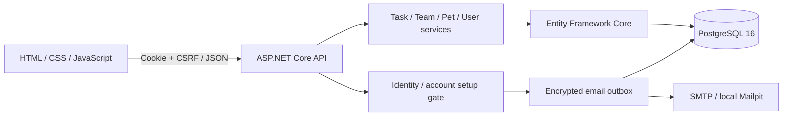

> v21までのREADMEの履歴です。現行仕様・導線はルートのREADMEを参照してください。相対リンクは旧READMEの位置を基準としています。

# Task Board

ASP.NET Core と PostgreSQL で作ったタスク管理APIに、カンバン形式のフロントエンドと育成ペット要素を組み合わせたポートフォリオアプリです。

タスクを TODO / DOING / DONE のボードで管理し、DONE に移動するとペットに経験値が入ります。タスクを進めるほどレベルや称号が変わるため、単なるCRUDではなく「続けたくなるタスク管理」を目指しています。

[](https://github.com/JSDevelop/task-app/actions/workflows/ci.yml)

> 無料のポートフォリオデモとして公開準備中です。ASP.NET Core Identity、メール確認・パスワード再設定、利用規約・プライバシーポリシーを実装しています。本番の運営情報設定、メール実配送、公開URLでの確認は別途必要です。

## 画面


タスクの追加はTODO欄の右上、検索ボタンの隣にある「＋」から行います。左側の「Task Board」欄には追加ボタンを置いていません。個人・チームとも同じ位置で操作できます。集中表示でTODO欄が隠れている場合は「ボード表示に戻す」から追加してください。


[チームを作成](docs/screenshots/app/v8/team-create-mobile-v8.png) / [作成後のメンバー招待](docs/screenshots/app/v8/team-invite-mobile-v8.png) / [Windows風のタグ絞り込み](docs/screenshots/app/v8/sidebar-tags-retro-v8.png)。v8も表示確認用モックデータで、画像内の招待コードは利用できないテスト値です。

[クラシック表示（共通のシンプル配置）](docs/screenshots/app/v5/classic-simple-desktop-v5.png) / [クラシック・モバイル](docs/screenshots/app/v5/classic-simple-mobile-v5.png) / [クラシック・設定](docs/screenshots/app/v5/classic-simple-options-v5.png) / [ペット設定](docs/screenshots/app/v3/team-options-pet-v3.png) / [ダーク・一覧レイアウト](docs/screenshots/app/v3/team-board-dark-list-v3.png)

クラシックも他のテーマと同じサイドバー・カード・設定画面を使用し、青空とグレーの配色だけを残しています。以前のタイトルバーや立体的な枠は、別の「Windows風」テーマで選べます。v5/v6画像は表示確認用のモックデータです。

[タスク設定・分類タグ](docs/screenshots/app/v7/task-settings-mobile-v7.png) / [複数タグのプルダウン](docs/screenshots/app/v7/tag-dropdown-mobile-v7.png) / [Windows風](docs/screenshots/app/v7/clean-retro-desktop-v7.png) / [Windows風の表示設定（v6時点）](docs/screenshots/app/v6/retro-options-v6.png)。v7画像も表示確認用モックデータです。

追加の画面: [森・コンパクト](docs/screenshots/app/v4/progression-forest-compact-v4.png) / [夕焼け・カード一覧](docs/screenshots/app/v4/progression-sunset-gallery-v4.png) / [集中表示](docs/screenshots/app/v4/progression-forest-focus-v4.png) / [6種類のペット](docs/screenshots/app/v4/progression-pets-mobile-v4.png) / [完了取消後の再ロック](docs/screenshots/app/v4/progression-relocked-v4.png)。高レベルの画像は表示検証専用データです。解放・再ロック自体は実タスクの75→100→75EXPでも確認しています。

## 主な機能

- 登録不要のお試しモード（`/index.html?demo=1`、実API・アカウントと分離、再読み込みでリセット）
- タスクの作成、編集、削除
- ステータス移動・削除を短時間「元に戻す」（経験値の二重付与を防止）
- タスク詳細内のチェックリスト（最大20項目）
- TODO / DOING / DONE のカンバン表示
- 個人 / チーム単位の切り替え、招待コードでの参加、チーム全体の進捗表示
- チーム管理者の引き継ぎ・退出・削除、共有タスクの競合検出
- チーム人数は無料3人（所有者込み）。アカウントProで所有する全チーム（新規チームを含む）の人数制限を解除。既存メンバー・データは保持
- Stripe Sandbox向けCheckout／署名Webhook／契約同期／解約を実装（ローカル5097は接続設定済み、実CheckoutのE2E確認待ち）。登録不要デモは明示した画面シミュレーション
- チーム内の担当者割り当て、15秒ごとの自動更新（非表示・編集中は停止）
- 「設定」に見た目・ペット・アカウント操作を集約
- 6テーマ・5レイアウト（Windows風とシンプル版を切り替え、追加の見た目はレベルで解放）
- 自由な分類タグを複数付与、分類別の全件集計・進捗・絞り込み、未使用タグの事前登録
- 設定内でタグの名前変更・削除・統合（タスク本体は保持）
- ドラッグアンドドロップによるステータス移動
- 期限、優先度、タグの設定とカード表示
- タイトル検索、タグ検索、ステータス検索、優先度検索、並び順、表示件数の指定
- DONEタスクの非表示切り替え
- タスク数が増えても列ごとにスクロールできるボード
- ユーザー登録・ログイン・ログアウト・アカウント削除
- ASP.NET Core IdentityとCookie認証によるユーザーごとのタスク・ペット分離
- メール確認、確認メール再送、パスワード再設定
- 既存アカウントへのメール登録・規約確認の案内
- 利用規約・プライバシーポリシーと公開環境の設定チェック
- ページングAPI
- DONE移動時のペット経験値付与
- ペット名・種類（犬 / 猫 / うさぎ / キツネ / パンダ / ドラゴン）変更、レベル、称号、連続達成、元気度表示
- 6種類 × 6表情 × 4段階の画像差分。Lv.5・10・20の成長した姿は自由選択
- Lv.1〜5で各レベル3候補から1点のごほうび。6種類のペット専用の帽子・リボン・クッション画像（全90点）で着せ替え。受取枠はペットの種類を変更しても共通で、受取済みの旧Lv.6以上の品も保持
- なでる／おやつ／休憩の触れ合い、10種の思い出と取得品のアルバム（設定内）
- 放置日数に応じたペットの元気度・気分表示
- DONE取り消しで元受取人の25EXPを戻し、レベル・完了数・解放状況を再計算
- 再完了・同時操作でも経験値が重複しない報酬記録
- ペット設定内の週間振り返り（日本時間の月曜始まり、今週と先週の完了実績）
- 本人だけのセーブポイント（ここまでできたこと・次の一歩・再開用リンク）
- チームのお助けサイン・立候補・解決と、助け合いのお礼の記録
- メンバー間の受け渡し便（お願い・資料・完了条件・受領／質問）
- タグやキーワードで再利用できる攻略ノート
- DONEの成果を額縁・モニター・本で飾る作品棚（説明とリンク、個人／チーム内限定）
- xUnit によるサービス層・認証・HTTP統合テスト

### v20のアカウントPro・購入確認画面

「設定 → アカウント → プラン・契約管理」から購入・状態確認・解約できます。チーム管理からも開けます。月額500円は1アカウントのテスト価格で、所有する全チーム（今後作成するチームを含む）が対象です。他の人が所有するチームは、その所有者のプランに従います。無料は各チーム所有者込み3人までです。無料に戻っても既存メンバー・タスク・経験値は残り、新規参加だけを制限します。

「アカウントProのプランを見る」から、無料／Pro比較、対象アカウント、毎月更新、解約後の扱いを確認できます。「Stripeでカード入力へ」を押すまでCheckoutを作成しません。決済後はサーバーで確認した状態だけでProを表示します。[表示用デモ](http://localhost:5097/index.html?demo=1&billing=plans&account=1)はStripeに接続しません。既存のテスト契約は購入者のアカウントへ移行するため再購入は不要です。チームの削除・所有権変更では契約を終了・譲渡しません。詳細は [v20作業記録](docs/ACCOUNT_BILLING_V20_WORK.md)。

v19では比較カードと購入内容サマリーを左右に分け、配色・余白・既存の猫イラストで購入画面を整えました。通常の購入ボタンは「Stripeでカード入力へ」で、カード番号・有効期限・CVCは遷移先のStripe画面で入力します。デモにはカード入力がないことと通常アプリへのログイン案内を追加しました。実請求は行いません。接続確認の範囲と画面変更は [v19作業記録](docs/RICH_PURCHASE_V19_WORK.md) を参照してください。

月額500円は実請求のないテスト価格です。**ローカル5097はStripe Sandboxへの接続設定済み**で、価格の読み取り・通知転送の接続を確認しました。実際のCheckoutによる購入・Pro反映・更新・解約のE2E試験は未実施です。チーム所有者が「設定 → タグ・チーム → チームの管理」からテストできます。新規環境の標準設定は引き続き連携無効です。[登録不要デモ](http://localhost:5097/index.html?demo=1)はStripeに接続しない画面シミュレーションです。接続手順、通知転送の再起動、検証範囲は [v17作業記録](docs/BILLING_V17_WORK.md) を参照してください。

### v16の使い方

[通常のアプリ](http://localhost:5097/) / [登録不要で5機能を試す](http://localhost:5097/index.html?demo=1)。タスクの「編集 → 相棒と進める」から記録できます。一覧は「設定 → ペット → 相棒と作業の続きを開く」。タスク作成時には「過去の攻略ノートを探す」から以前の学びを再利用できます。メイン画面に常設欄は追加していません。

個人ではセーブポイント・攻略ノート・作品棚、チームでは加えてお助けサイン・受け渡し便を利用できます。セーブポイントは共有タスクでも本人限定で、その他の記録はそのチーム内で共有します。これらの記録操作は経験値・担当者・タスクの状態を自動変更しません。作品棚は説明と成果物リンクを飾る初版で、画像アップロードや自動公開はありません。

実装・保存範囲・API・検証結果・ローカルの復旧手順は [v16作業記録](docs/COMPANION_V16_WORK.md) を参照してください。新しい一体型ペット画像90枚の透過・反映は別の残作業です。

### v15の使い方

ローカル確認: [通常のアプリ](http://localhost:5097/) / [登録不要で試す](http://localhost:5097/index.html?demo=1)。お試しの操作はブラウザー内だけに保存され、実際のチーム招待・共有やアカウント操作は行いません。

担当者とチェックリストはタスクの作成・編集画面にあります。移動・削除後の「元に戻す」は15秒間表示し、サーバーの復元権限は30秒で失効します。別の編集が入ったタスクは上書きせず競合を表示します。短命の復元用データは期限切れ後の定期処理（1分間隔）で削除します。

タグ整理は「設定 → タグ・チーム」、週間振り返りは「設定 → ペット」の折りたたみ内です。管理用の常設パネルはメイン画面に追加していません。詳しい実装・検証・画像の残作業は [v15作業記録](docs/USABILITY_V15_WORK.md) を参照してください。新しい一体型ペット画像90枚はまだ未透過・未反映で、既存の透過素材を使用しています。

## 設計・品質面のポイント

- Controller / Service / DTO / EF Core の責務分離
- Identity標準形式のパスワードハッシュを使用（反復回数600,000）。旧PBKDF2形式は正しいパスワードでのログイン時に再ハッシュ
- 新規登録・再設定のパスワードは12〜100文字。5回の認証失敗で15分間ロックアウト
- 認証CookieはHttpOnly、本番Secure、絶対有効期間8時間。認証情報をLocal/Session Storageへ保存しない
- 全更新系APIでCSRF検証。未認証は `401`、メール・規約確認未完了のデータ操作は `403`
- ログアウトで既存の全Cookieセッションを失効。メール確認・再設定ではSecurityStampも更新
- 確認リンク24時間・再設定リンク30分。設定済みの固定originからリンクを生成し、秘密情報はURLフラグメントに配置
- SMTP送信待ちをData Protectionで暗号化してDB保存し、送信成功または期限切れ後に削除
- 認証エンドポイントをIP単位でレート制限し、新規登録数をPostgreSQLのトランザクションロック付きで上限制御
- API全体のレート制限、リクエスト・説明文・検索文字数・ユーザー別タスク数の上限
- 個人タスク・ペット・設定をユーザー単位で分離。共有タスクは所属チームのルートでのみ操作可能
- タスク完了・ペット報酬・初回達成の思い出を同じトランザクションで保存
- 外部キー、enum範囲制約、正規化したユーザー名・メールの一意索引によるDB整合性保護
- PostgreSQLの`xmin`を使った楽観的排他制御と、状態・完了フラグの整合性制約
- 共有タスクの更新・削除はクライアントのversion必須。DBトランザクションとadvisory lockで上限・退出・完了報酬の競合を保護
- Problem Details、Migration確認付きヘルスチェック、CSPを含むセキュリティヘッダー
- 非rootユーザーで動くマルチステージDockerイメージ
- GitHub Actions によるビルド・テスト・公開成果物の検証
- 生成日・プロンプト方針を記録したオリジナルのペット画像（[asset provenance](frontend/assets/pet/ASSET_NOTES.md)）



## 技術構成

- .NET 10 LTS / ASP.NET Core Web API
- Entity Framework Core
- ASP.NET Core Identity / Data Protection / Antiforgery
- MailKit / SMTP（ローカルはMailpit）
- PostgreSQL 16
- xUnit
- HTML / CSS / JavaScript
- Docker Compose

## 起動方法

前提環境:

- .NET 10 SDK
- Docker Desktop または Docker Engine / Compose

### 1. ローカルツールを復元

```bash
dotnet tool restore
```

### 2. PostgreSQLとローカル受信用Mailpitを起動

```bash
docker compose up -d
```

### 3. DBマイグレーションを適用

```bash
ASPNETCORE_ENVIRONMENT=Development dotnet ef database update
```

### 4. アプリを起動

```bash
dotnet run --urls http://localhost:5095
```

### 5. ブラウザで開く

`http://localhost:5095/` を開きます。新規登録ではユーザーID、表示名、テスト用メールアドレス、12文字以上の専用パスワードを入力し、利用規約への同意・プライバシーポリシーの確認を行います。

確認メールは `http://localhost:8025/` のMailpitで受信します。メール内のリンクから確認し、あらためてログインするとタスクボードを利用できます。Mailpitはローカルの受信箱で、実際の宛先へメールを配信しません。

フロントエンドとAPIは必ず同じoriginで開いてください。Live Server、`file://`、別originへのAPI接続は非対応です。`localhost`と`127.0.0.1`も混在させないでください。

開発設定のメールリンクは `http://localhost:5095` 向けです。URLを変える場合は `Authentication__PublicBaseUrl` も同じoriginへ変更します。開発用鍵は `.local/keys` に保存します（Git管理外）。

既存アカウントはこれまでのユーザーID・パスワードでログインした後、メール登録と規約確認へ進みます。既存のタスク・ペットのIDは保持しますが、旧Bearerトークンは使用できません。既存DBへ適用する前に [移行手順](docs/DEPLOYMENT.md#identityへの移行) を確認してください。

公開環境ではDB接続、HTTPS origin、永続鍵、SMTP、運営情報を設定します。[.env.example](.env.example) は設定項目の一覧であり、未設定のまま本番起動できません。ASP.NET Coreは `.env` を自動では読み込まないため、デプロイ基盤の環境変数・Secretまたはコンテナの `--env-file` で渡します。

コンテナイメージの作成:

```bash
docker build -t task-board .
```

公開成果物にはAPIだけでなく `frontend/` も含まれます。

ホストに.NET 10 SDKがない場合も上記Dockerビルドでバックエンドのビルド・テストができます。実行用イメージにはSDK・EF CLIを含みません。Migrationは.NET 10 SDKのある専用環境から実行してください。

本番公開のTLS、信頼済みプロキシ、Secret、Migration、監視、バックアップ手順は [Deployment Guide](docs/DEPLOYMENT.md) を参照してください。

## API一覧

### Tasks

| Method | Endpoint | 内容 |
| --- | --- | --- |
| GET | `/api/tasks` | タスク一覧取得 |
| GET | `/api/tasks/{id}` | タスク詳細取得 |
| POST | `/api/tasks` | タスク作成 |
| PUT | `/api/tasks/{id}` | タスク更新 |
| DELETE | `/api/tasks/{id}` | タスク削除 |

`GET /api/tasks` のクエリ例:

| Query | 例 | 内容 |
| --- | --- | --- |
| `search` | `search=README` | タイトル検索 |
| `status` | `status=Todo` | `Todo` / `Doing` / `Done` で絞り込み |
| `priority` | `priority=2` | `0: 低` / `1: 中` / `2: 高` で絞り込み |
| `tag` | `tag=portfolio` | タグ検索 |
| `tagExact` | `tagExact=programmer` | タグ名の完全一致（大小文字を区別しない）。空指定は400 |
| `untagged` | `untagged=true` | タグのないタスク。`tagExact`と同時指定不可 |
| `isCompleted` | `isCompleted=true` | 完了状態で絞り込み。互換用 |
| `sortOrder` | `sortOrder=desc` | `desc` / `asc` |
| `page` | `page=1` | ページ番号 |
| `pageSize` | `pageSize=10` | 1ページの件数。最大100 |

ログイン後はブラウザーが認証Cookieを送信します。POST / PUT / DELETEなどの更新系リクエストには、`GET /api/auth/csrf` が返す `token` を `X-CSRF-TOKEN` ヘッダーに付け、同じCookie jarを使います。登録・ログインを含む匿名APIもCSRF検証対象です。ログイン・ログアウトなどで認証状態が変わった後はCSRFトークンを再取得します。

```http
X-CSRF-TOKEN: {GET /api/auth/csrf の token}
```

認証なし・無効・期限切れは `401`、アカウントの確認未完了は `403`（`account_setup_required`）、CSRF不正は `400`（`csrf_invalid`）です。Bearerヘッダーでの認証には対応していません。手動確認例は [TaskApi.http](TaskApi.http) を参照してください。

### Companion（相棒と進める）

| Method | Endpoint | 内容 |
| --- | --- | --- |
| GET | `/api/companion` | 個人のしおり・作品棚・最近の学び |
| GET | `/api/companion/notes?q=&tags=&excludeTaskId=` | 個人の攻略ノート検索 |
| GET | `/api/companion/tasks/{taskId}` | タスクの記録と更新用バージョン |
| POST | `/api/companion/tasks/{taskId}` | 記録操作（`action`を指定） |

チーム版は `/api/companion` を `/api/teams/{teamId}/companion` に置き換えます。所属外・別スコープは404。更新には直前のGET/POSTが返した `version` と `updatedAt` を、それぞれ `version`・`expectedUpdatedAt` として送ります。競合は409で、入力を残し最新の記録を読み直してから明示的に再保存します。操作一覧・上限は [v16 API](docs/COMPANION_V16_WORK.md#api) に記載しています。

### Auth

| Method | Endpoint | 内容 |
| --- | --- | --- |
| GET | `/api/auth/config` | 登録受付・規約版・公開運営情報 |
| GET | `/api/auth/csrf` | CSRFトークンと対応Cookieの取得 |
| GET | `/api/auth/session` | ログイン状態・必要なアカウント設定 |
| POST | `/api/auth/register` | 登録・確認メール予約・限定セッション発行 |
| POST | `/api/auth/login` | ログイン（未確認なら限定セッション） |
| POST | `/api/auth/complete-registration` | 既存ユーザーのメール登録・規約確認 |
| POST | `/api/auth/resend-confirmation` | 確認メール再送依頼 |
| POST | `/api/auth/confirm-email` | メール確認・既存セッション失効 |
| POST | `/api/auth/forgot-password` | 確認済みメールへの再設定依頼 |
| POST | `/api/auth/reset-password` | パスワード再設定・既存セッション失効 |
| POST | `/api/auth/logout` | 現ユーザーの全Cookieセッションを失効 |

メール再送・再設定依頼は、アカウントの存在を直接返さない共通の `202` 応答です。同じユーザーへの送信予約は1分間隔で制限します。登録情報の重複は `409`、登録停止・上限は `503` です。

タスク作成（`POST /api/tasks`）のリクエスト例:

```json
{
  "title": "READMEを整える",
  "description": "概要、起動方法、API一覧を書く",
  "isCompleted": false,
  "status": "Todo",
  "dueDate": "2026-07-01T00:00:00Z",
  "priority": 2,
  "tags": "portfolio, docs"
}
```

### Pet

| Method | Endpoint | 内容 |
| --- | --- | --- |
| GET | `/api/pet` | ペット情報取得 |
| GET | `/api/pet/weekly-review` | 今週・先週の有効完了数と日別実績（本人の報酬記録のみ） |
| PUT | `/api/pet` | ペット名・種類更新（経験値は保持） |
| GET | `/api/pet/collection` | ごほうび・成長段階・装備・思い出一覧 |
| POST | `/api/pet/rewards` | `{level:1..5, choice:"hat"/"bow"/"mat"}` の1点受取（旧Lv.6〜20の取得済み記録は保持） |
| PUT | `/api/pet/appearance` | `stage` と `hatLevel` / `bowLevel` / `matLevel`（未装備はnull）を保存 |
| POST | `/api/pet/interactions` | `{action:"pet"/"treat"/"rest"}` の触れ合いを記録 |

ごほうびは各レベル1点だけで、受取後の選び直しはできません。同じ品の再送は成功扱い、別の品への変更は409です。完了取り消しで必要レベルを下回ると対象の装備・成長姿だけが外れ、受取記録と思い出は残ります。レベルを上げ直しても追加取得や自動再装備はありません。触れ合いに経験値・元気度の増加はありません。新規のごほうびはLv.5までで、旧Lv.6〜20の取得済み品は保持します。

操作はサイドバーの相棒を押すか「設定 → ペット」から。「名前・種類を変更」は同じ画面の折りたたみにあります。[ごほうび画面](docs/screenshots/pets/collection-v12/pet-gifts-desktop-v12.png) / [着せ替え](docs/screenshots/pets/collection-v12/pet-dress-desktop-v12.png) / [スマホのアルバム](docs/screenshots/pets/collection-v12/pet-album-mobile-v12.png)。これらの画面は専用の表示検証データです。

### User

| Method | Endpoint | 内容 |
| --- | --- | --- |
| GET | `/api/user` | 現在ユーザー情報取得 |
| PUT | `/api/user` | 現在ユーザーの表示名更新 |
| GET / PUT | `/api/user/preferences` | theme / layoutの取得・保存 |
| GET | `/api/user/unlocks` | 現在レベル、全選択肢の解放状態・必要Lv・残りEXP |
| DELETE | `/api/user` | 現在ユーザーと関連データを削除 |

ペット名更新リクエスト例:

```json
{
  "name": "Task Pet",
  "species": "cat"
}
```

### Teams

ボード上部の「個人」「参加中のチーム名」タブで表示先を切り替えます。選択した範囲のタスク・タグだけを表示し、切り替え時は検索・タグ絞り込みをリセットします。チームが多いときはタブ部分を横スクロールできます。左右矢印／Home／Endでタブへ移動し、Enter／Spaceで決定できます。「設定 → タグ・チーム」の選択とも同期します。

チーム作成・参加は「⚙ 設定 → タグ・チーム」にまとめています。メイン画面にはチーム作成ボタンを置いていません。

1. 「＋ チームを作成」からチーム名を入力し、「チームを作成」を押します。
2. 作成後の招待コードをコピーして、信頼できるメンバーへ送ります。相手はログイン後、「設定 → タグ・チーム → 招待コードで参加」に入力します。
3. 「共有ボードを開く」で、そのチームのタスクを追加・編集できます。個人タスクは自動で共有されません。

コピーできないブラウザーではコードを選択して手動コピーできます。発行したコードは画面を閉じると非表示になり、再発行は「設定 → タグ・チーム → 選択中のチームを管理」からできます。「設定 → タグ・チーム」には作成・参加それぞれの直接ボタン、ワークスペース切り替え、更新、全体進捗も残しています。メインの件数表示で「個人（非公開）」またはチーム名と「共有」を確認できます。

| Method | Endpoint | 内容 |
| --- | --- | --- |
| GET / POST | `/api/teams` | 所属一覧 / チーム作成 |
| POST | `/api/teams/join` | `{ "inviteCode": "..." }` で参加 |
| GET / DELETE | `/api/teams/{id}` | 詳細・メンバー / 管理者によるチーム削除 |
| GET | `/api/teams/{id}/summary` | ページやフィルターによらない全件の進捗 |
| POST | `/api/teams/{id}/invites` | 管理者によるコード再発行（7日間、以前のコードは失効） |
| PUT | `/api/teams/{id}/owner` | `{ "userProfileId": 123 }` で既存メンバーに管理者を引き継ぐ |
| DELETE | `/api/teams/{id}/members/me` | 退出（管理者は先に引き継ぎかチーム削除） |
| GET / POST | `/api/teams/{id}/tasks` | 共有タスクの一覧 / 作成 |
| GET / PUT / DELETE | `/api/teams/{id}/tasks/{taskId}` | 共有タスク取得 / 更新 / 削除 |

各ユーザー10チーム、無料チームは所有者込み3人、個人・各チームのタスクはそれぞれ500件が上限です。アカウントProの有効期間中は所有する全チームの人数上限を解除します（サービス全体の登録上限は別）。既存の超過メンバーは削除せず、新規参加だけ制限します。招待コードは作成・再発行時だけ表示し、DBにはハッシュ値を保存します。管理者引き継ぎでも旧コードは失効します。契約はチーム削除・所有権変更では終了・譲渡されず、アカウントに保持されます。アカウント削除前には決済・契約を終了してください。

共有タスクのPUTは取得時の `version` を本文に、DELETEは `?version=...` に指定します。更新済み・未指定は409です。個人用ルートへ共有タスクIDを渡しても操作できません。個人タスクの自動共有・移動は行いません。完了させた利用者のペットに25EXPを付与し、完了取り消しではその受取人から戻します。チームは15秒間隔で変更を確認します（リアルタイム配信ではありません）。非表示・編集中・移動中・保存中は自動反映せず、古い取得結果も破棄します。「更新」ボタンでも取得できます。期限は日付として保存し、日本時間（JST）の暦日で判定します。

タスク作成・更新には `assigneeUserProfileId`（チームの在籍者IDまたはnull）、`checklist`（`{ "text": "確認する", "isCompleted": false }` の配列、最大20件）を指定できます。個人タスクに担当者は設定できません。担当者の退出・退会時は割り当てを解除します。移動時の応答の `undo`、削除時の `X-Task-Undo` / `X-Task-Undo-Expires` ヘッダーを使い、`POST /api/tasks/undo/{token}` または `POST /api/teams/{id}/tasks/undo/{token}` で取り消せます。認証・CSRF・操作者・チーム所属・期限・競合を検証し、トークンは一度のみ使用できます。

退会時は個人タスク・ペット・設定を削除し、共有タスクは作成者との関連を外してチームに残します。管理者は引き継ぎまたはチーム削除後に退会できます。チーム削除では共有タスクも削除されます。

## 分類タグ

左側の「タグで絞り込み」プルダウンから、すべて・未分類・プログラマーなどの各タグを選べます。設定内の分類選択と同期し、件数はワークスペース全体で集計します。タグ名の登録・分類の進捗確認は「設定 → タグ・チーム」に残しています。個人・チームの作成／編集画面では、従来どおり複数のタグをチェックできます。左のプルダウン末尾の「＋ 新しいタグを追加…」を選ぶと、設定の追加フォームへ直接移動できます。選択中の絞り込みは維持し、閉じるとプルダウンへ戻ります。設定の「＋ 新しいタグを追加」からも登録できます。「追加先」で個人用か選択中チーム用かを確認し、タグ名を1つずつ入力してください。既存CSVと合計300文字制限は維持します。分類選択中の新規タスクはそのタグを初期値にし、Escは先に選択プルダウンだけを閉じます。

「＋ 新しいタグを追加」ではタスクがない分類も事前登録できます。1〜50文字、カンマ・制御文字は使用不可、同じワークスペースに登録できる定義は50個までです。旧タスク由来のタグは登録数に含みません。登録済みタグは未使用になっても保持します。「タグを整理」では名前変更・削除・既存タグへの統合ができ、選択中の個人／チームの付与済みタグもまとめて更新します。タグ削除でタスク本体や経験値は削除しません。タスクから個別のタグを外す操作は編集でできます。

| Method | Endpoint | 内容 |
| --- | --- | --- |
| GET / POST | `/api/task-tags` | 個人用のタグ集計 / `{ "name": "プログラマー" }` で事前登録 |
| GET / POST | `/api/teams/{id}/task-tags` | 所属チームのタグ集計 / 事前登録（メンバー共通） |
| POST | `/api/task-tags/manage` | `{ "name": "旧タグ", "action": "rename" / "delete" / "merge", "targetName": "変更先" }` で整理 |
| POST | `/api/teams/{id}/task-tags/manage` | 選択チームのタグを同じ形式で整理 |

集計は現在の検索・ページに関係なく、ワークスペース全体のTODO/DOING/DONEを数えます。複数タグを付けたタスクはそれぞれのタグで数えるため、分類の件数を合計すると重複します。分類タグは担当者やユーザーの役割ではなく、手動で付けるタスクの分類です。個人用のタグ・タスクがチームへ自動で共有されることはありません。

## 経験値とレベル報酬

TODO / DOING間の移動では経験値は変わりません。DONEで25EXP、DONEからTODO / DOINGへ戻すと元の受取人から25EXPと完了数1を取り消します。再完了すれば25EXPを再付与し、行き来だけでは増え続けません。受取人がチームを退出していても取り消し対象です。退会済みユーザーは復活させません。タスク・チーム自体の削除は完了取り消しとは別で、獲得済みEXPを保持します。

| レベル | 解放される選択肢 | 必要な合計EXP |
| --- | --- | --- |
| 1 | 犬・猫・うさぎ、クラシック・Windows風・ライト・ダーク、ボード・リスト | 0 |
| 2 | キツネ | 100 |
| 3 | 森テーマ・コンパクト | 250 |
| 4 | パンダ | 450 |
| 5 | 夕焼けテーマ・カード一覧 | 700 |
| 6 | ドラゴン | 1000 |
| 7 | 集中表示 | 1350 |

現在レベルで解放状態を判定し、下回れば再ロックします。選択中のものがロックされた場合は犬 / クラシック / ボードに戻しますが、ペット名は保持します。再解放後は自分で選び直せます。APIも未解放の選択を403 `unlock_required`で拒否します。集中表示は検索対象の現在ページからDOING優先で最大3件だけを表示し、非表示件数と全体表示へ戻るボタンを示します。

移行前から取り消し済みの個人タスクは既知の受取人の残留EXPを補正します。旧共有タスクには受取人の記録がないため推測で他人から控除しません。過去の元気や不明な活動履歴は保守的に保持します。詳細は [移行手順](docs/DEPLOYMENT.md) を参照してください。

## 検証範囲

自動テストでは、次の回帰を確認します。最新の実行結果はCIの実行ログを参照してください。CI設定があること自体は、公開環境での試験成功を意味しません。

- タスクCRUD、ユーザー分離、完了報酬の重複防止
- Cookie認証、CSRF、未確認ユーザーのアクセス制限、退会
- 旧パスワードの移行、メール確認・再設定・リンクの無効化
- メール送信キューと登録制限
- フロントエンド認証処理、同一origin制約、公開成果物

本番メールの実配送、公開URL、PC・スマートフォン実機での最終確認は未完了です。[公開チェックリスト](docs/PORTFOLIO_RELEASE_CHECKLIST.md) を参照してください。

最新v21のローカル検証では、バックエンド248件、JavaScript118件、PNG検査4件が成功。「お助け」の送信形式を修正し、実Chrome→HTTP→PostgreSQLで相棒機能の全16更新操作と共有・競合保護を82項目確認しました。タスク周辺と認証・メールの実API試験、課金を含むデモUI試験も成功しています。実Stripeでの新たな支払い・解約試験や公開環境試験ではありません。変更は未pushのためリモートCIは未実行です。詳細は [v21修正・確認記録](docs/TRANSPORT_V21_WORK.md) を参照してください。

## テスト

チーム作成の設定集約・タグ追加の導線改善後は、バックエンド165件・フロント86件とDocker buildが成功しました。Chromeモック17画面でPC/375pxのクラシック・Windows風、320px設定、チーム操作の設定内配置、タグ追加への直接移動とフォーカス復帰、絞り込み維持、重複・失敗・再試行・保存中の操作制限、チーム参加と共有タグの分離を重点確認しました。タグ名と追加ボタンはスマホでも一緒に見える位置へ移動します。APIはモックで、今回DB/APIは変更していません。前段の分類タグ実装時には実PG＋SMTPの78リクエストで集計・権限境界・並行登録も確認済みです。公開URLでの試験ではありません。

クラシック簡略化後もバックエンド140件・フロントエンド37件とDockerビルドが成功しています。Chromeでclassic/light/dark×5レイアウト×PC/375pxの30画面と設定6画面をモックデータで検証し、共通配置・行高・横はみ出しなし・設定操作を確認しました。今回DBや認証・報酬の処理は変更していません。

```bash
dotnet test
node --test tests/*.test.cjs
```

フロントエンドテストにはNode.js 22以降を使用します。バックエンドのHTTP統合テストはテスト用DBを使うため、PostgreSQL固有のMigration・制約・並行処理は別途実DBで確認します。

## 補足

実販売・本番課金は行わず、Stripe Sandboxでのテスト課金のみを実装しています。外部IdP、MFA、確認済みメールアドレスの変更は対象外です。Identity導入だけで一般向けサービスの運用・法的要件を満たすと保証するものではありません。公開設定と残作業は [Handoff](docs/HANDOFF.md) にまとめています。
